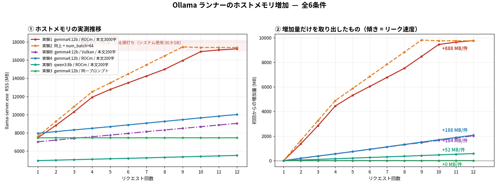
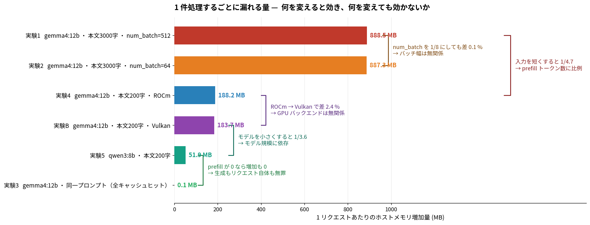
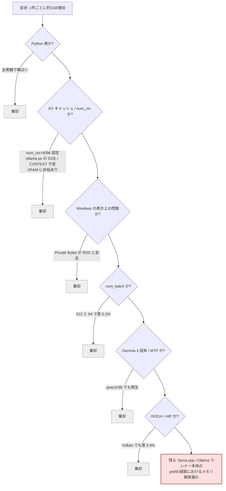

# Ollama ランナーのホストメモリリーク 調査報告

**対象**: [`Sekainokanata/mail_digest`](https://github.com/Sekainokanata/mail_digest) 実行時に発生するメインメモリの異常増加
**調査日**: 2026-07-27
**計測スクリプト**: `memcheck.py`（本レポート同梱）

---

## 結論

> 1. **`llama-server.exe`（Ollama の推論サブプロセス）が、prefill したトークン数に比例したホストメモリを解放せずに積み上げている。**
> 2. **本アプリケーションのコードに原因はない。** Python 側のメモリは全実験を通じて完全に横ばい。
> 3. **設定では回避できない。** `num_batch`・GPU バックエンド・`num_ctx` はいずれも無関係であることを実測で確認済み。上流（llama.cpp / Ollama ランナー）の不具合。

**リーク速度は「使用モデル」と「プロンプトのトークン数」で決まる。**
`gemma4:12b-it-qat` で本文 3000 字を投げると **1 件あたり 888 MB**。物理メモリを使い切るまで際限なく増える。

---

## 1. 症状

メールを 1 件判定するごとに、システムのメインメモリ使用量が 1 GB 規模で増加する。
数件ごとに Ollama を再起動しないと処理を継続できない。GPU メモリ（VRAM）には終始余裕があり、増えているのはホスト側の RAM のみ。

## 2. 環境

| 項目 | 値 |
| --- | --- |
| OS | Windows |
| GPU | AMD Radeon RX 7800 XT（VRAM 16 GB） |
| Ollama | v0.32.4（`AppData\Local\AMD\AI_Bundle\Ollama` — AMD 同梱ビルド） |
| バックエンド | ROCm gfx1101（比較用に Vulkan でも実施） |
| モデル | `gemma4:12b-it-qat`（10.0 GB, 100% GPU）／ 比較用 `qwen3:8b` |
| `num_ctx` | 4096（VRAM ベースで自動決定） |
| `OLLAMA_NUM_PARALLEL` | 4 |
| `OLLAMA_MAX_LOADED_MODELS` | 1 |
| `OLLAMA_FLASH_ATTENTION` | false |

## 3. 計測方法

`memcheck.py` により、1 リクエストごとに全 Ollama 関連プロセスの
**RSS（ワーキングセット）** と **Private Bytes（コミット）** を記録した。

各実験は 12 リクエスト。実験間では `ollama serve` を再起動し条件を揃えた。

```bash
python memcheck.py --n 12 --mode vary --body-len 3000                   # 実験1
python memcheck.py --n 12 --mode vary --body-len 3000 --num-batch 64    # 実験2
python memcheck.py --n 12 --mode same --body-len 3000                   # 実験3
python memcheck.py --n 12 --mode vary --body-len 200                    # 実験4
python memcheck.py --n 12 --mode vary --body-len 200 --model qwen3:8b   # 実験5
# 実験B は OLLAMA_LLM_LIBRARY=vulkan / HIP_VISIBLE_DEVICES=-1 で実験4 と同条件
```

## 4. 実験一覧と結果

| # | モデル | 本文長 | 変更点 | 増加量 / 件 |
| --- | --- | --- | --- | --- |
| 実験1 | gemma4:12b | 3000 字 | ベースライン | **888.5 MB** |
| 実験2 | gemma4:12b | 3000 字 | `num_batch` 512 → 64 | **887.3 MB** |
| 実験3 | gemma4:12b | 3000 字 | **毎回同一のプロンプト** | **0.1 MB** |
| 実験4 | gemma4:12b | 200 字 | 入力を短縮 | **188.2 MB** |
| 実験5 | **qwen3:8b** | 200 字 | モデル変更 | **51.9 MB** |
| 実験B | gemma4:12b | 200 字 | **ROCm → Vulkan** | **183.7 MB** |



左が実測値、右が初回からの増加量。**右図の傾きがそのままリーク速度**である。
実験1・2 が 10 件目付近で頭打ちになっているのは解決ではなく、**システム使用量が 30.9 GB に達して物理メモリを使い切ったため**。



---

## 5. 確定した事実と、その根拠

### 5.1 犯人は `llama-server.exe` ただ一つ

| プロセス | 挙動 |
| --- | --- |
| `python.exe` | 増加なし |
| `ollama app.exe` | 45〜49 MB で横ばい |
| `ollama.exe`（サーバ本体） | 54〜93 MB で横ばい |
| **`llama-server.exe`（推論ランナー）** | **単調増加** |

全 6 実験で例外なくこの結果。Ollama のスケジューラも、アプリケーションの Python コードも無罪である。

### 5.2 Windows の表示上の問題ではなく、本物のヒープ確保

`Private Bytes`（コミット済みメモリ）が `RSS` と**完全に同じ傾きで並走**している。

| バックエンド | Private − RSS |
| --- | --- |
| ROCm | 532 MB（12 リクエスト中ずっと一定） |
| Vulkan | 3,996 MB（同上・一定） |

差分が定数ということは、増えている分はすべて実際に確保されたヒープである。
mmap やワーキングセットの見かけ上の増加であれば Private は動かない。

> Vulkan の 3,996 MB はドライバがホスト可視メモリとして予約するアドレス空間で、増えていないため無害。

### 5.3 リークの引き金は「新規トークンの prefill」のみ

**実験3 が決定的である。**
毎回まったく同一のプロンプトを 12 回投げた結果、`7,461 MB → 7,462 MB`、**増加ゼロ**。

同一プロンプトではプロンプトキャッシュがヒットして prefill がスキップされる。
一方で生成処理（`num_predict=64`）は他の実験と同じく毎回実行されている。したがって:

- リクエストを投げること自体では漏れない
- トークンを**生成**しても漏れない
- **キャッシュに無いトークンを prefill したときだけ漏れる**

これは同時に「1 リクエストあたりの固定コスト（切片）は 0 である」ことの直接測定でもある。

### 5.4 リーク量は prefill トークン数に比例する

同一モデル・同一設定で入力長だけを変えた比較:

| 本文長 | 増加量 / 件 |
| --- | --- |
| 3000 字（実験1） | 888.5 MB |
| 200 字（実験4） | 188.2 MB |

**入力を短くすると 1/4.7 になる。** 5.3 の切片ゼロと合わせ、`増加量 ≒ 係数 × prefillトークン数` という単純な比例関係が成立する。

### 5.5 係数はモデル規模に依存する

同一条件（本文 200 字・ROCm）でモデルのみ変更:

| モデル | 増加量 / 件 |
| --- | --- |
| gemma4:12b-it-qat | 188.2 MB |
| qwen3:8b | 51.9 MB |

**3.63 倍の差。** ただしこの比は語彙数比（1.73）・パラメータ数比（1.50）・層数比（1.33）のいずれとも一致せず、単一の構造パラメータでは説明できない。トークナイザが異なるため実効トークン数も揃っていない。**内部で何が漏れているかの特定には至っていない。**

### 5.6 上限がない

qwen3:8b の増分は 50.4 / 50.5 / 51.0 / 50.8 / 51.0 / 50.4 / 54.2 / 54.3 / 54.2 / 54.2 / 50.4 MB と、
12 件を通じて頭打ちの兆候がまったくない。gemma4:12b が停止したのは物理メモリ枯渇時のみ。

---

## 6. 棄却した仮説



| 仮説 | 検証方法 | 結果 |
| --- | --- | --- |
| Python 側のリーク | 全プロセスの個別計測 | **棄却** — 横ばい |
| KV キャッシュ / `num_ctx` の増大 | `ollama ps` の CONTEXT・SIZE 監視 | **棄却** — 4096 / 10.0 GB で不変 |
| Windows のワーキングセット表示 | Private Bytes との比較 | **棄却** — 並走 |
| logits バッファ（バッチ幅依存） | `num_batch` 512 vs 64 | **棄却** — 差 0.1 % |
| Gemma 4 固有（MTP 投機的デコード） | qwen3:8b で再現試験 | **棄却** — 同様に発生 |
| ROCm / HIP のホストメモリ確保 | Vulkan バックエンドで再現試験 | **棄却** — 差 2.4 % |
| プロンプトキャッシュの蓄積 | 同一プロンプト反復 | **棄却** — 増加ゼロ |

## 7. 未検証の項目

| 項目 | 内容 |
| --- | --- |
| ビルドの違い | AMD AI\_Bundle 版ではなく **ollama.com 公式版** で同一バージョンを検証していない |
| バージョン回帰 | v0.30 系など**旧バージョン**での検証をしていない |
| 内部構造体の特定 | どのオブジェクトが解放されていないかは、ソース調査またはヒーププロファイラが必要 |

上 2 つは「実際に直る可能性が残っている」唯一の項目であり、優先して確認する価値がある。

---

## 8. 対策

根治は上流の修正待ちだが、**`増加量 ≒ 係数 × prefillトークン数`** という関係が確定したため、消費量を設計で制御できる。

### 8.1 使用モデルを変更する

| モデル | 増加量 / 件（本文 200 字） | 相対 |
| --- | --- | --- |
| gemma4:12b-it-qat | 188.2 MB | 1.00 |
| **qwen3:8b** | **51.9 MB** | **0.28** |

重要度判定は 12B を要するタスクではない。判定は 8B に委ね、要約のみ 12B に回す 2 段構成とすれば品質を落とさずに **1/3.6** にできる。

### 8.2 プロンプトのトークン数を削る

増加量は prefill トークン数にほぼ完全に比例するため、削った分がそのまま効く。

- 本文の切り出しを **4000 字 → 600 字** に短縮（重要度判定に本文後半は不要）
- HTML タグ・URL・引用行・署名を除去してから投入

```python
import re

def clean_body(text: str, limit: int = 600) -> str:
    text = re.sub(r'<[^>]+>', ' ', text)                    # HTML タグ除去
    text = re.sub(r'https?://\S+', '[URL]', text)           # URL 圧縮
    text = re.sub(r'^[>｜|].*$', '', text, flags=re.M)      # 引用行除去
    text = re.sub(r'[-─═_]{5,}.*', '', text, flags=re.S)    # 罫線以降（署名）切り捨て
    return re.sub(r'\s+', ' ', text).strip()[:limit]
```

### 8.3 固定文をすべてプロンプト先頭に寄せる

実験3 が示す通り、**キャッシュヒットした部分の prefill コストはゼロ**である。
現在は可変のメール本文の**後ろ**に出力形式の指示があり、この部分が毎回 prefill されている。

```text
現状: [固定の判定基準] → [可変のメール] → [固定のJSON指示]   ← 末尾の固定文が毎回再処理される
改善: [固定の判定基準 + JSON指示] → [可変のメール]           ← 先頭ブロックは2件目以降ゼロコスト
```

### 8.4 累積 prefill トークン数で再ロードする

固定件数ごとの再起動より正確で、かつ**サーバ再起動は不要**（モデルのアンロードでランナープロセスごと消えるためメモリは全て返る）。

```python
BUDGET_TOKENS = 6000          # 許容増加量[MB] ÷ 係数[MB/token] から決める
accum = 0

for mail in mails:
    prompt = build_prompt(mail)
    est_tokens = len(prompt) // 2          # 日本語は概ね 2 文字 = 1 トークン
    if accum + est_tokens > BUDGET_TOKENS:
        judge.eject(); judge.load()        # 数秒で完了
        accum = 0
    result = judge.judge(mail)
    accum += est_tokens                    # 実測するなら resp['prompt_eval_count']
```

### 8.5 LLM に渡す件数自体を減らす

`List-Unsubscribe` ヘッダの有無、`noreply@` 送信元、既知の配信ドメインといったルールベースの前段フィルタで、実運用では 6〜7 割が LLM に到達せずに済む。総トークン数がそのまま削れる。

### 8.6 効果の見積もり

| 構成 | 増加量 / 件 | 6 GB 消費までの処理件数 |
| --- | --- | --- |
| 現状（12B・本文 4000 字） | 約 1,200 MB | **約 5 件** |
| 8.2 のみ適用 | 約 250 MB | 約 24 件 |
| **8.1 + 8.2 + 8.3 適用** | **約 40 MB** | **約 150 件** |

---

## 9. 上流への報告について

本調査のデータは、そのまま Ollama の不具合報告として通用する水準にある。要点は以下の 4 点。

- **バックエンド非依存**（ROCm / Vulkan で同一）
- **モデル非依存**（gemma4:12b / qwen3:8b の双方で発生、量のみ異なる）
- **prefill トークン数に比例**（切片ゼロ）
- **プロンプトキャッシュヒット時は増加ゼロ**（生成処理は無関係）

`memcheck.py` と各実験の CSV を添付すれば再現手順として完結する。

---

## 付録: 同梱ファイル

| ファイル | 内容 |
| --- | --- |
| `memcheck.py` | 計測スクリプト |
| `memcheck1.csv` 〜 `memcheck4.csv` | 実験1〜4 の生データ |
| `memcheck.csv` | 実験5（qwen3:8b）の生データ |
| `memcheckB.csv` | 実験B（Vulkan）の生データ |
| `fig1_memory.png` / `fig2_factors.png` | 本レポートの図 |
